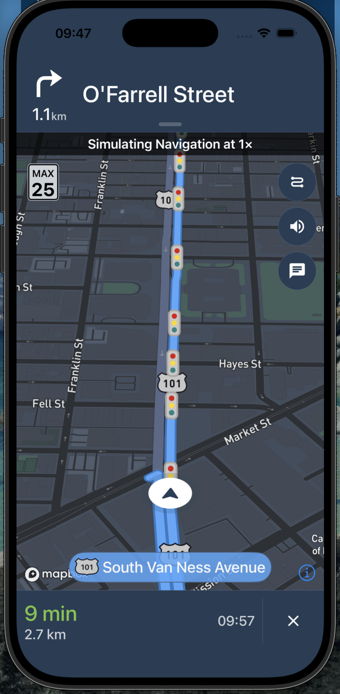
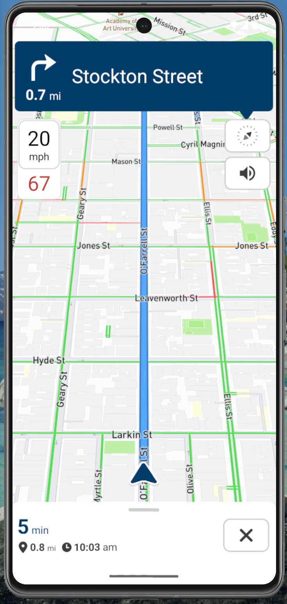
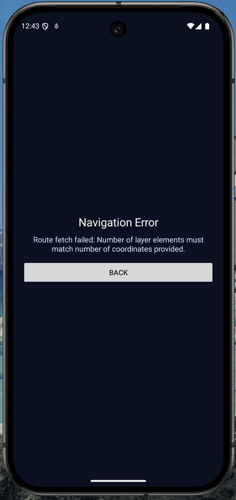

# @atomiqlab/react-native-mapbox-navigation

Native Mapbox turn-by-turn navigation for Expo + React Native on iOS and Android.

Current package version: `1.1.6`.

This package provides full-screen navigation and embedded navigation view options.

---

## Why This Package

- Expo-friendly setup via config plugin
- Full-screen native UX on iOS + Android
- Optional embedded navigation view with explicit opt-in (`enabled`)
- Strong bottom banner customization (`native` and `customNative`)
- Runtime controls and event listeners
- Session-guarded flow to prevent overlapping navigation sessions

---

## Feature Highlights

- `startNavigation(options)` full-screen navigation
- `stopNavigation()` and `isNavigating()` session controls
- Runtime updates:
  - `setMuted`
  - `setVoiceVolume`
  - `setDistanceUnit`
  - `setLanguage`
- Event listeners:
  - location/progress/journey/banner/arrival/cancel/error
  - Android destination preview/changed
  - bottom-sheet action press
- Bottom sheet modes:
  - `native` (Mapbox SDK bottom banner)
  - `customNative` (package expandable native sheet)

---

## Support Us

<p align="center">
  <a href="https://ko-fi.com/atomiqlabs" target="_blank">
    
  </a>
</p>

---

## Embedded View Status

`MapboxNavigationView` is available again with a guarded lifecycle:

- it does not auto-start unless `enabled={true}`
- this reduces session-conflict loops between embedded and full-screen modes
- keep one mode active at a time
- if you wrap it in `SafeAreaView`, consider disabling the bottom edge if you want the bottom sheet flush to the screen
- use embedded mode for maximum UI customization (React-rendered overlay sheet/banner)
- use `startNavigation()` for the simplest, quickest integration (full-screen native)
- Android: request runtime location permission before `enabled={true}` (for example via `react-native-permissions` or `PermissionsAndroid`)

If you don’t want extra dependencies, you can request permission with React Native:

```ts
import { PermissionsAndroid, Platform } from "react-native";

export async function ensureLocationPermissionAndroid() {
  if (Platform.OS !== "android") return true;
  const res = await PermissionsAndroid.request(
    PermissionsAndroid.PERMISSIONS.ACCESS_FINE_LOCATION,
  );
  return res === PermissionsAndroid.RESULTS.GRANTED;
}
```

Minimal example:

```tsx
import { MapboxNavigationView } from "@atomiqlab/react-native-mapbox-navigation";

<MapboxNavigationView
  enabled
  style={{ flex: 1 }}
  startOrigin={{ latitude: 37.7749, longitude: -122.4194 }}
  destination={{ latitude: 37.7847, longitude: -122.4073, name: "Downtown" }}
  shouldSimulateRoute
  bottomSheet={{ enabled: true, mode: "overlay", initialState: "hidden" }}
/>;
```

Test screen (recommended while integrating):

```tsx
import React, { useEffect, useMemo, useState } from "react";
import { PermissionsAndroid, Platform, Pressable, StyleSheet, Text, View } from "react-native";
import {
  MapboxNavigationView,
  type BannerInstruction,
  type RouteProgress,
  type Waypoint,
} from "@atomiqlab/react-native-mapbox-navigation";

const START: Waypoint = {
  latitude: 37.7749,
  longitude: -122.4194,
  name: "Start",
};
const DEST: Waypoint = {
  latitude: 37.7847,
  longitude: -122.4073,
  name: "Downtown",
};

function formatInstruction(instruction?: BannerInstruction): string {
  const primary = instruction?.primaryText?.trim();
  const secondary = instruction?.secondaryText?.trim();
  if (primary && secondary) return `${primary} • ${secondary}`;
  return primary || secondary || "Waiting for banner…";
}

function formatRemaining(progress?: RouteProgress): string {
  if (!progress) return "Waiting for progress…";
  const meters = Math.round(progress.distanceRemaining);
  const minutes = Math.max(0, Math.round(progress.durationRemaining / 60));
  const pct = Math.round((progress.fractionTraveled ?? 0) * 100);
  return `${meters}m • ${minutes} min • ${pct}%`;
}

export default function EmbeddedNavigationTestScreen() {
  const [permissionGranted, setPermissionGranted] = useState(
    Platform.OS !== "android",
  );
  const [enabled, setEnabled] = useState(Platform.OS !== "android");
  const [useCustomSheet, setUseCustomSheet] = useState(false);
  const [lastError, setLastError] = useState("");

  useEffect(() => {
    if (Platform.OS !== "android") {
      return;
    }
    PermissionsAndroid.check(PermissionsAndroid.PERMISSIONS.ACCESS_FINE_LOCATION)
      .then((has) => {
        setPermissionGranted(has);
        setEnabled(has);
      })
      .catch(() => {});
  }, []);

  const requestPermission = async () => {
    if (Platform.OS !== "android") {
      setPermissionGranted(true);
      setEnabled(true);
      return;
    }
    const res = await PermissionsAndroid.request(
      PermissionsAndroid.PERMISSIONS.ACCESS_FINE_LOCATION,
    );
    const granted = res === PermissionsAndroid.RESULTS.GRANTED;
    setPermissionGranted(granted);
    if (granted) setEnabled(true);
  };

  const bottomSheet = useMemo(
    () => ({
      enabled: true,
      mode: "overlay" as const,
      initialState: "hidden" as const,
      revealGestureHotzoneHeight: 120,
      revealGestureRightExclusionWidth: 80,
      collapsedHeight: 124,
      expandedHeight: 340,
      showHandle: true,
      enableTapToToggle: true,
      builtInQuickActions: ["overview", "recenter", "toggleMute", "stop"],
    }),
    [],
  );

  return (
    <View style={styles.container}>
      <MapboxNavigationView
        enabled={enabled && permissionGranted}
        style={StyleSheet.absoluteFill}
        startOrigin={START}
        destination={DEST}
        shouldSimulateRoute
        bottomSheet={bottomSheet}
        onError={(e) => setLastError(`${e.code}: ${e.message}`)}
        renderBottomSheet={
          useCustomSheet
            ? ({
                state,
                show,
                hide,
                toggle,
                bannerInstruction,
                routeProgress,
              }) => (
                <View style={styles.sheet}>
                  <Text style={styles.sheetTitle}>{state.toUpperCase()}</Text>
                  <Text style={styles.sheetPrimary} numberOfLines={2}>
                    {formatInstruction(bannerInstruction)}
                  </Text>
                  <Text style={styles.sheetSecondary} numberOfLines={1}>
                    {formatRemaining(routeProgress)}
                  </Text>

                  <View style={styles.row}>
                    <Pressable
                      style={styles.btn}
                      onPress={() => show("collapsed")}
                    >
                      <Text style={styles.btnText}>Show</Text>
                    </Pressable>
                    <Pressable style={styles.btn} onPress={toggle}>
                      <Text style={styles.btnText}>Toggle</Text>
                    </Pressable>
                    <Pressable style={styles.btn} onPress={hide}>
                      <Text style={styles.btnText}>Hide</Text>
                    </Pressable>
                  </View>
                </View>
              )
            : undefined
        }
      >
        <View pointerEvents="box-none" style={styles.overlayTop}>
          <View style={styles.card}>
            <Text style={styles.title}>Embedded Navigation Test</Text>

            <Text style={styles.meta}>
              permissionGranted: {String(permissionGranted)}
            </Text>
            <Text style={styles.meta}>enabled: {String(enabled)}</Text>
            {lastError ? (
              <Text style={styles.error}>error: {lastError}</Text>
            ) : null}

            {!permissionGranted ? (
              <Pressable style={styles.btn} onPress={requestPermission}>
                <Text style={styles.btnText}>Grant Location Permission</Text>
              </Pressable>
            ) : (
              <View style={styles.row}>
                <Pressable
                  style={styles.btn}
                  onPress={() => setEnabled((v) => !v)}
                >
                  <Text style={styles.btnText}>
                    {enabled ? "Disable" : "Enable"}
                  </Text>
                </Pressable>
                <Pressable
                  style={styles.btn}
                  onPress={() => setUseCustomSheet((v) => !v)}
                >
                  <Text style={styles.btnText}>
                    {useCustomSheet ? "Use Default Sheet" : "Use Custom Sheet"}
                  </Text>
                </Pressable>
              </View>
            )}
          </View>
        </View>
      </MapboxNavigationView>
    </View>
  );
}

const styles = StyleSheet.create({
  container: { flex: 1, backgroundColor: "#0b1020" },
  overlayTop: { ...StyleSheet.absoluteFillObject, padding: 12 },
  card: {
    backgroundColor: "rgba(15, 23, 42, 0.9)",
    borderRadius: 14,
    padding: 12,
    gap: 8,
  },
  title: { color: "#fff", fontSize: 16, fontWeight: "800" },
  meta: { color: "#9cc7ff", fontSize: 12, fontWeight: "600" },
  error: { color: "#fecaca", fontSize: 11, fontWeight: "700" },
  row: { flexDirection: "row", gap: 8 },
  btn: {
    flex: 1,
    backgroundColor: "#2563eb",
    borderRadius: 10,
    padding: 10,
    alignItems: "center",
  },
  btnText: { color: "#fff", fontSize: 12, fontWeight: "800" },
  sheet: { flex: 1, gap: 8 },
  sheetTitle: { color: "#fff", fontSize: 12, fontWeight: "800" },
  sheetPrimary: { color: "#fff", fontSize: 14, fontWeight: "800" },
  sheetSecondary: {
    color: "rgba(255,255,255,0.8)",
    fontSize: 12,
    fontWeight: "600",
  },
});
```

## React Node in `startNavigation`

Passing a React Node directly into native full-screen `startNavigation()` bottom banner is not currently possible through the bridge.

For complex React-authored UI in the banner area, use embedded `MapboxNavigationView` with:

- `enabled={true}`
- `bottomSheet.mode = "overlay"`
- `renderBottomSheet` / `bottomSheetContent`

---

## Requirements

- Expo SDK `>= 50`
- iOS `14+`
- Mapbox tokens:
  - public token: `pk...`
  - downloads token: `sk...` with `DOWNLOADS:READ`

---

## Installation

```bash
npm install @atomiqlab/react-native-mapbox-navigation
```

---

## Expo Setup

Add plugin in `app.json` or `app.config.js`:

```json
{
  "expo": {
    "plugins": ["@atomiqlab/react-native-mapbox-navigation"]
  }
}
```

Set env vars:

- `EXPO_PUBLIC_MAPBOX_ACCESS_TOKEN`
- `MAPBOX_DOWNLOADS_TOKEN`

Regenerate native projects:

```bash
npx expo prebuild --clean
```

---

## Quick Start

```ts
import {
  startNavigation,
  stopNavigation,
  addLocationChangeListener,
  addRouteProgressChangeListener,
  addJourneyDataChangeListener,
  addBannerInstructionListener,
  addArriveListener,
  addCancelNavigationListener,
  addErrorListener,
} from "@atomiqlab/react-native-mapbox-navigation";

await startNavigation({
  destination: { latitude: 37.7847, longitude: -122.4073, name: "Downtown" },
  startOrigin: { latitude: 37.7749, longitude: -122.4194 },
  shouldSimulateRoute: true,
  routeAlternatives: true,
  cameraMode: "following",
  uiTheme: "system",
  distanceUnit: "metric",
  language: "en",
  bottomSheet: {
    enabled: true,
    mode: "customNative",
    initialState: "hidden",
    revealOnNativeBannerGesture: true,
    revealGestureHotzoneHeight: 100,
    revealGestureRightExclusionWidth: 80,
    collapsedHeight: 120,
    expandedHeight: 340,
    showsTripProgress: true,
    showsManeuverView: true,
    showsActionButtons: true,
    showCurrentStreet: true,
    showRemainingDistance: true,
    showRemainingDuration: true,
    showETA: true,
    showCompletionPercent: true,
    backgroundColor: "#0f172a",
    primaryTextColor: "#ffffff",
    secondaryTextColor: "#bfdbfe",
    primaryTextFontWeight: "700",
    secondaryTextFontWeight: "500",
    actionButtonTitle: "End Navigation",
    secondaryActionButtonTitle: "Support",
    primaryActionButtonBehavior: "stopNavigation",
    secondaryActionButtonBehavior: "emitEvent",
    actionButtonCornerRadius: 12,
    actionButtonFontWeight: "700",
    quickActions: [
      { id: "overview", label: "Overview", variant: "secondary" },
      { id: "recenter", label: "Recenter", variant: "ghost" },
    ],
    quickActionCornerRadius: 12,
    quickActionFontWeight: "700",
    headerTitle: "Trip",
    headerSubtitle: "Swipe up to reveal",
    headerTitleFontWeight: "700",
    headerBadgeText: "PRO",
    headerBadgeCornerRadius: 10,
    builtInQuickActions: ["overview", "recenter", "toggleMute", "stop"],
  },
});

const subscriptions = [
  addLocationChangeListener((e) => console.log(e)),
  addRouteProgressChangeListener((e) => console.log(e)),
  addJourneyDataChangeListener((e) => console.log("journey", e)),
  addBannerInstructionListener((e) => console.log(e.primaryText)),
  addArriveListener((e) => console.log(e)),
  addCancelNavigationListener(() => console.log("cancelled")),
  addErrorListener((e) => console.warn(e)),
];

// cleanup
subscriptions.forEach((s) => s.remove());
await stopNavigation();
```

---

## API Overview

### Core Methods

- `startNavigation(options)`
- `stopNavigation()`
- `isNavigating()`
- `getNavigationSettings()`
- `setMuted(muted)`
- `setVoiceVolume(volume)`
- `setDistanceUnit(unit)`
- `setLanguage(language)`

### Event Listeners

- `addLocationChangeListener(listener)`
- `addRouteProgressChangeListener(listener)`
- `addJourneyDataChangeListener(listener)`
- `addBannerInstructionListener(listener)`
- `addArriveListener(listener)`
- `addCancelNavigationListener(listener)`
- `addErrorListener(listener)`
- `addBottomSheetActionPressListener(listener)`
- `addDestinationPreviewListener(listener)` (Android)
- `addDestinationChangedListener(listener)` (Android)

---

## NavigationOptions

Top-level options:

- `destination` (required)
- `startOrigin` (optional)
- `waypoints`
- `shouldSimulateRoute`
- `mute`
- `voiceVolume`
- `distanceUnit`
- `language`
- `cameraMode`
- `cameraPitch`
- `cameraZoom`
- `mapStyleUri`
- `mapStyleUriDay`
- `mapStyleUriNight`
- `uiTheme`
- `routeAlternatives`
- `showsSpeedLimits`
- `showsWayNameLabel`
- `showsTripProgress`
- `showsManeuverView`
- `showsActionButtons`
- `showsReportFeedback`
- `showsEndOfRouteFeedback`
- `showsContinuousAlternatives`
- `usesNightStyleWhileInTunnel`
- `routeLineTracksTraversal`
- `annotatesIntersectionsAlongRoute`
- `androidActionButtons`
- `bottomSheet`

---

## Bottom Sheet Options (`bottomSheet`)

Behavior and structure:

- `enabled`
- `mode`: `"native" | "customNative"`
- `showsTripProgress`
- `showsManeuverView`
- `showsActionButtons`
- `initialState`: `"hidden" | "collapsed" | "expanded"`
- `collapsedHeight`
- `expandedHeight`
- `contentHorizontalPadding`
- `contentBottomPadding`
- `contentTopSpacing`
- `showHandle`
- `enableTapToToggle`
- `revealOnNativeBannerGesture`
- `revealGestureHotzoneHeight`
- `revealGestureRightExclusionWidth`

Visibility content flags:

- `showCurrentStreet`
- `showRemainingDistance`
- `showRemainingDuration`
- `showETA`
- `showCompletionPercent`

Main style fields:

- `backgroundColor`
- `handleColor`
- `primaryTextColor`
- `secondaryTextColor`
- `primaryTextFontSize`
- `primaryTextFontFamily`
- `primaryTextFontWeight`
- `secondaryTextFontSize`
- `secondaryTextFontFamily`
- `secondaryTextFontWeight`
- `cornerRadius`

Action button fields:

- `actionButtonTitle`
- `secondaryActionButtonTitle`
- `primaryActionButtonBehavior`: `"stopNavigation" | "emitEvent"`
- `secondaryActionButtonBehavior`: `"none" | "stopNavigation" | "emitEvent"`
- `actionButtonBackgroundColor`
- `actionButtonTextColor`
- `secondaryActionButtonBackgroundColor`
- `secondaryActionButtonTextColor`
- `actionButtonBorderColor`
- `actionButtonBorderWidth`
- `actionButtonCornerRadius`
- `actionButtonFontSize`
- `actionButtonFontFamily`
- `actionButtonFontWeight`
- `actionButtonHeight`
- `actionButtonsBottomPadding`

Quick action fields:

- `quickActions`
- `builtInQuickActions`
- `quickActionBackgroundColor`
- `quickActionTextColor`
- `quickActionSecondaryBackgroundColor`
- `quickActionSecondaryTextColor`
- `quickActionGhostTextColor`
- `quickActionBorderColor`
- `quickActionBorderWidth`
- `quickActionCornerRadius`
- `quickActionFontFamily`
- `quickActionFontWeight`

Custom native additions:

- `customRows`
- `headerTitle`
- `headerTitleFontSize`
- `headerTitleFontFamily`
- `headerTitleFontWeight`
- `headerSubtitle`
- `headerSubtitleFontSize`
- `headerSubtitleFontFamily`
- `headerSubtitleFontWeight`
- `headerBadgeText`
- `headerBadgeFontSize`
- `headerBadgeFontFamily`
- `headerBadgeFontWeight`
- `headerBadgeBackgroundColor`
- `headerBadgeTextColor`
- `headerBadgeCornerRadius`
- `headerBadgeBorderColor`
- `headerBadgeBorderWidth`

Built-in quick action IDs:

- `overview`
- `recenter`
- `mute`
- `unmute`
- `toggleMute`
- `stop`

---

## Session Lifecycle Rules

- Keep only one active navigation session at a time.
- Guard rapid repeated starts.
- Always call `stopNavigation()` on screen teardown.

```ts
useEffect(() => {
  return () => {
    stopNavigation().catch(() => {});
  };
}, []);
```

Safe start guard:

```ts
let starting = false;

async function safeStartNavigation(
  options: Parameters<typeof startNavigation>[0],
) {
  if (starting || (await isNavigating())) return;
  starting = true;
  try {
    await startNavigation(options);
  } finally {
    starting = false;
  }
}
```

---

## Platform Notes

- Full-screen `startNavigation`: iOS + Android
- Bottom sheet `mode = "native"`: iOS + Android
- Bottom sheet `mode = "customNative"`: iOS + Android
- `startOrigin` optional in full-screen (both platforms)
- `onDestinationPreview` / `onDestinationChanged`: Android only
- iOS custom row icon supports `iconSystemName` (SF Symbols)

---

## Common Error Codes

- `NAVIGATION_SESSION_CONFLICT`
- `MAPBOX_TOKEN_INVALID`
- `MAPBOX_TOKEN_FORBIDDEN`
- `MAPBOX_RATE_LIMITED`
- `ROUTE_FETCH_FAILED`
- `ROUTE_FETCH_CANCELED`
- `CURRENT_LOCATION_UNAVAILABLE`
- `INVALID_COORDINATES`

Use `addErrorListener` to surface and log these.

---

## Screenshots

<p align="center">
  
  
  
</p>

---

## Support

<p align="center">
  <a href="https://ko-fi.com/atomiqlabs" target="_blank">
    
  </a>
</p>
